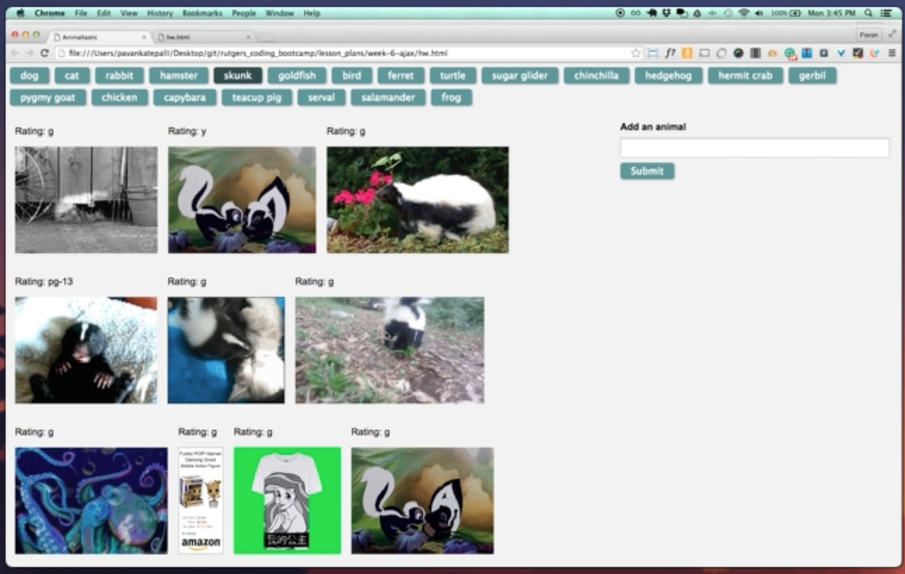
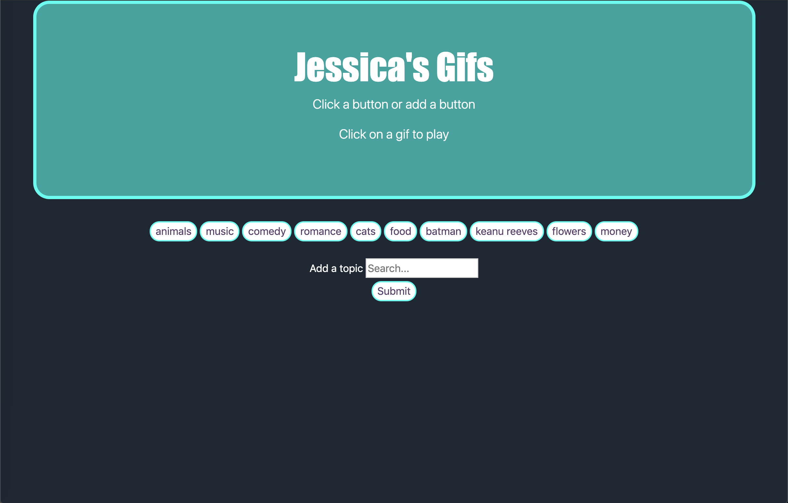

# GifTastic

## About
This app uses the GIPHY API (https://giphy.com/) to make a dynamic web page that populates with gifs of the users choice. 

## How to use
Click on the buttons which are part of an array of topics already created. Click any button to view gifs, the gifs are clickable so you may click to play and pause. Try adding a gif by submitted something in the box. This will become a button and work by using Giphy's api to respond a gif of that key word(s). 
Enjoy! 

## Technologies Used
* JavaScript
* jQuery
* Bootstrap
* HTML/CSS

## App Features
* JSON
* Ajax
* HTTP GET requests
* Server-side APIs

## Developer Notes
This app uses the jQuery Ajax method to make requests to the server-side APIs (Application Programming Interface, which is a set of protocols that allow us to hook into the functionality of another application and use it within our own). 

## Before and After

